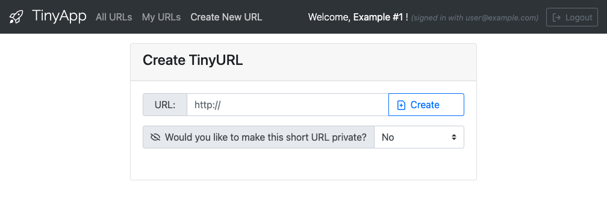
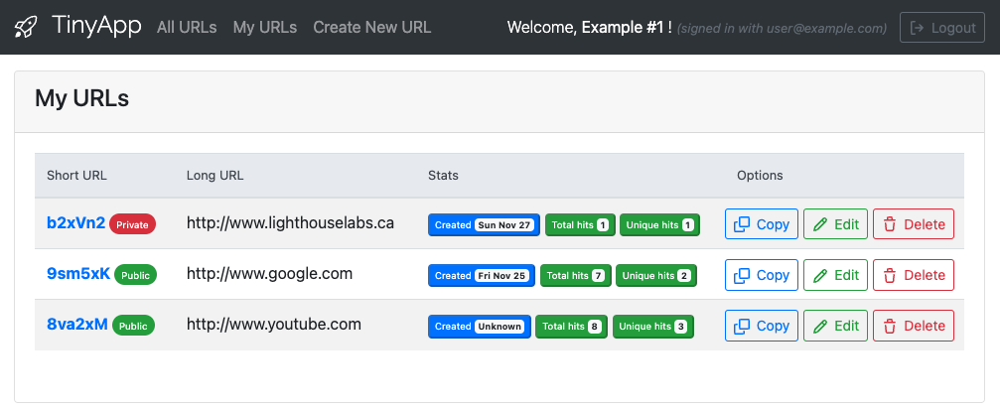
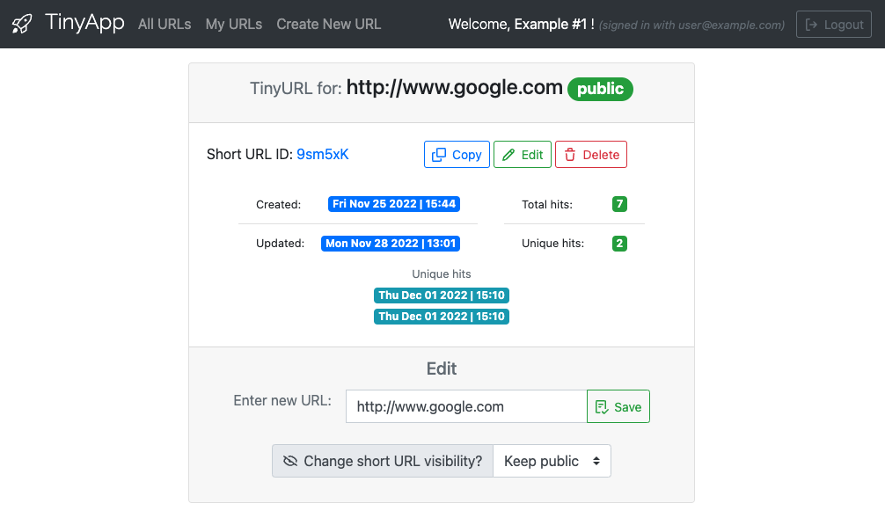

# TinyApp Project

TinyApp is a full stack web application built with Node and Express that allows users to shorten long URLs (à la bit.ly).

## Final Product

*Click on screenshots to see mobile variant*

## Dependencies

- Node.js
- Express
- EJS
- bcryptjs
- cookie-session
- method-override
- morgan

## Getting Started

- Install all dependencies (using the `npm install` command).
- Run the development web server using the `node express_server.js` command.

## Test accounts/users:

- user@example.com / purple-monkey-dinosaur
- user2@example.com / dishwasher-funk
