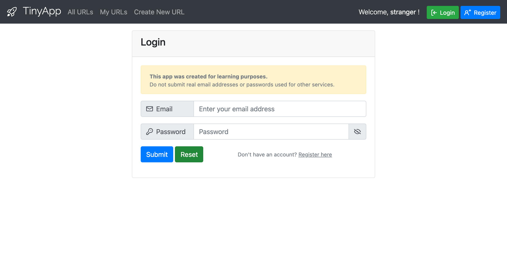

# TinyApp Project

TinyApp is a full stack web application built with Node and Express that allows users to shorten long URLs (à la bit.ly).

## Extra features

My TinyApp project includes the LHL stretch features as well as other added functionalities.

- Quality of life functionality
  - Tooltips for most form inputs
  - Dynamic form labels depending on viewport size/mobile
  - Show/hide password on login/register pages
  - Dynamic, fully rendered error pages
- Short URL features
  - Statistics
    - Created date
    - Updated date
    - Total hits
    - Unique hits & log
  - Bonus features
    - Copy to clipboard
    - Set as private/public (determines visibility on All URLs page)
    - Reassign to different owner
- User profile
  - Users can have a unique username
  - Users can edit their username
  - Users can set site theme preference

## Final Product

*Click on screenshots to see mobile variant*

## Dependencies

- Node.js
- Express
- EJS
- bcryptjs
- cookie-session
- method-override
- morgan

## Getting Started

- Install all dependencies (using the `npm install` command).
- Run the development web server using the `node express_server.js` command.

## Test accounts/users:

- user@example.com / purple-monkey-dinosaur
- user2@example.com / dishwasher-funk
